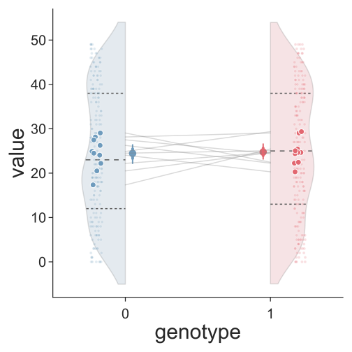
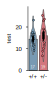
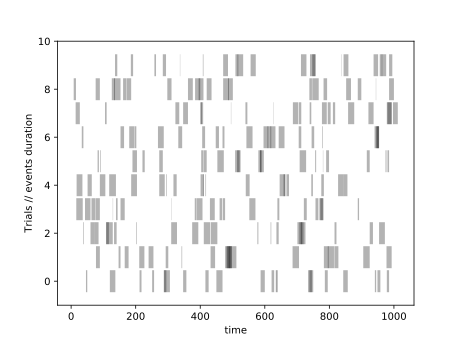

# dataVizPy
functions for dataVizualiztion in Python
The file [`dataViz.py`](https://github.com/RumbaughLab/dataVizPy/blob/master/dataViz.py) generate the type of output below that include
* 1/2 violin plot with KDE displaying median and quantile
* mean as dot
* thick bar sem
* thin bar 95% confidence interval

## specific case for 2grp comparison and standard feature
*svg are very easy to useful to drag and drop in powerpoint and illustrator*
functions for dataVizualiztion in Python some feature can be added or remove
The file [`2gpComp.py`](https://github.com/RumbaughLab/dataVizPy/blob/master/2gpComp.py)  generate the type of output below that include
* 1/2 violin plot with KDE displaying median and quantile
* mean as dot
* thick bar sem
* thin bar 95% confidence interval

# raster example
This is a quick example to plot raster with 'toy data' see the [`code`](https://github.com/RumbaughLab/dataVizPy/blob/master/dataViz.py) 

